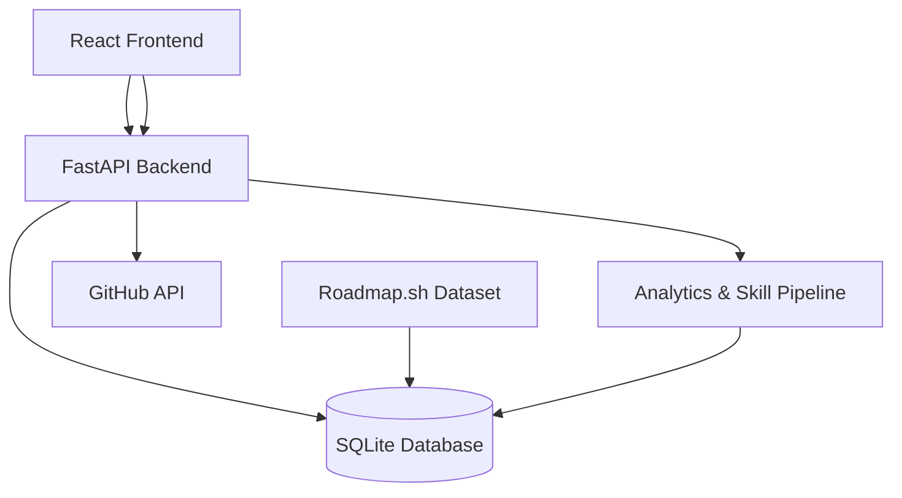

# Adaptive Learning System with Integrated Analytics Pipeline

## Overview

This system builds adaptive learning paths based on real user skill signals. It uses the roadmap.sh graph as a curriculum backbone and computes adaptive difficulty using engagement, GitHub, resume, and synthesized skill profile metrics. It tracks progress, trust score, and proficiency dynamically across an authenticated namespace. It securely uses JWT authentication and supports GitHub OAuth linking, extracts skill signals automatically from repositories, and synthesizes all signals into a unified SkillProfile.

This is not just a course catalog.
This is an adaptive intelligence system.

---

## Core Architecture



---

## System Capabilities

- **Unified Skill Synthesis Engine**: Collects and normalizes discrete credentials (like parsed PDF Resumes and automated GitHub repository language scraping) into a single, standardized capability score (`SkillProfile`) per user. Multiple sources are scaled via configurable credibility multipliers.
- **Adaptive Learning Engine**: Evaluates readiness dynamically. Uses a weighted scoring model blending historical platform engagement (`trust_score`) at 70% confidence against external evidence (`skill_weight`) at 30% confidence to scale curriculum difficulty on an Elo-based logic model mapping from 800 to 2000.
- **Curriculum Traversal & Pacing**: Transforms `roadmap.sh` static graphs into complex Directed Acyclic Graph (DAG) sequences calculating depth, managing strictly locked constraints, and tracking completed checkpoints mapped against the difficulty thresholds.
- **GitHub Intelligent Extraction**: A robust async integration pipeline that securely exchanges OAuth codes, links development identities, and automatically fetches repository distributions calculating byte sizes across programming languages into structured skill weight signals. 
- **Resume Processing Pipeline**: Supports direct PDF file uploads wrapping `pdfplumber` to process and scrape textual history mapping standard roadmap signals against total token presence.
- **Secure Authentication Integrity**: Built from the ground up prioritizing stateless JWT bearer interactions. Incorporates rigorous CSRF state guarding on OAuth links, automated missing environment fallbacks, and prohibits payload-spoofing by stripping explicitly passed `user_id` assignments.

---

## Technical Stack

- **Backend Architecture**: FastAPI, Uvicorn, SQLAlchemy Data Abstractions
- **Frontend Architecture**: React, Vite
- **Database**: SQLite
- **Integrations**: `httpx` (Async external API), `pdfplumber` (Document parsing), `python-jose` & `passlib[bcrypt]` (Cryptography)

---

## Backend Deployment Guide

1. **Install Requirements**:
   ```bash
   cd backend
   pip install -r requirements.txt
   ```

2. **Configure Environment Secret Layer**:
   Create a `.env` deployment file inside the `backend/` directory:
   ```env
   GITHUB_CLIENT_ID=your_client_id
   GITHUB_CLIENT_SECRET=your_client_secret
   GITHUB_REDIRECT_URI=http://localhost:8000/auth/github/callback
   SECRET_KEY=dev_secret_key_change_in_production
   ```

3. **Initialize Database and Seed Application Data**:
   Whenever migrating or creating databases, these must be run sequentially to recreate schemas and calculate prerequisite topology difficulties.
   ```bash
   rm app.db  # (Only if replacing an existing database)
   python create_tables.py
   python scripts/extract_roadmaps.py
   python scripts/compute_difficulty.py
   ```

4. **Launch API System**:
   ```bash
   uvicorn main:app --reload
   ```
   The backend logic binds natively to `http://localhost:8000`.

---

## Frontend Setup Instructions

1. **Install Modules**:
   ```bash
   npm install
   ```
2. **Execute Application UI**:
   ```bash
   npm run dev
   ```

---

## Developer Notice

- Data Models (`UserSkill`, `SkillWeight`, `SkillProfile`, `Course`) are extensively interrelated. Do not isolate logic paths or execute standalone insertions. Rely heavily on the integrated `services/skill_synthesizer.py` when passing user signals into the `SkillProfile` to maintain adaptive scaling integrity.
- Use the `get_current_user` routing injection uniformly across isolated API functions. 

## License
MIT License
